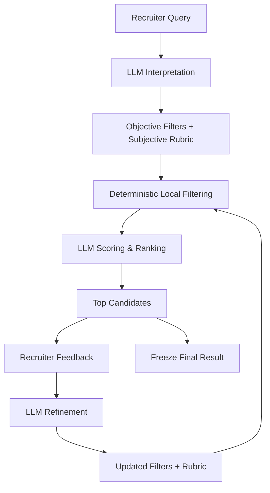
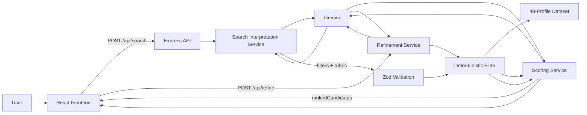
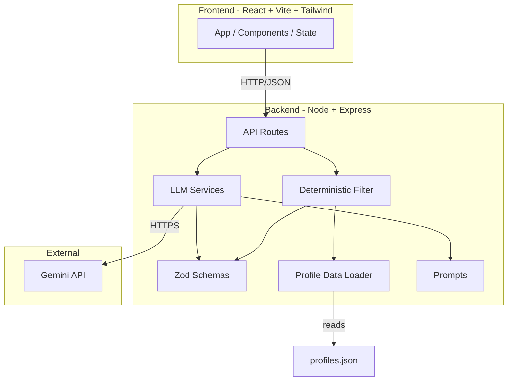

# Flexiple AI Recruiter

### AI-Powered Sourcing & Refinement Loop

A focused slice of an AI recruiter workflow: a recruiter types a natural-language hiring brief, the system translates it into explicit hard requirements and a subjective fit rubric, applies the hard requirements against a 48-profile talent dataset, scores the survivors with an LLM, and lets the recruiter refine the search through feedback until a final shortlist is frozen.

`React` `TypeScript` `Vite` `Tailwind` `Node.js` `Express` `Zod` `Gemini`

---

## 📦 What is Flexiple AI Recruiter?

Recruiters usually begin with intent, not filter forms: *"Senior backend engineer, 5+ years, startup background, comfortable with AWS."* Hard-nosed boolean search drops most of that. LLM-only search is hard to audit. The interesting product question is how to combine them.

This project does exactly that:

- The recruiter's free text is interpreted by a real server-side LLM call into two structured artefacts — an `ObjectiveFilters` object and a `FitRubric` object.
- The objective filters are applied **deterministically** (no LLM) to a supplied fictional talent dataset.
- The surviving candidates are sent back to the LLM and scored against the subjective rubric.
- The recruiter can then refine the search with natural-language feedback. The LLM proposes updated filters and rubric; the deterministic filter and LLM scoring run again.
- When the recruiter is happy, the search is **frozen** as the final shortlist.

The focus is a working end-to-end **sourcing refinement loop**, not a production recruiting platform. The supplied dataset contains 48 fictional candidate profiles; there is no real 98M-profile database, no ATS, no CRM, no auth, and no persistence between sessions. That is intentional — the assignment is the loop, and the loop is the only thing being evaluated.

---

## 🔄 Sourcing Refinement Loop



| Stage | What happens |
|---|---|
| **Recruiter Query** | Free-text brief typed into the search panel. |
| **LLM Interpretation** | Gemini returns a structured `filters` object + `rubric` object, validated with Zod. |
| **Deterministic Local Filtering** | Pure-TypeScript filter against the 48-profile dataset (skills, experience, location, company type). |
| **LLM Scoring & Ranking** | All filtered candidates are sent to Gemini with the rubric, scored 0–100, sorted, top 5 returned. |
| **Top Candidates** | UI displays the ranked shortlist with score, explanation, and Yes/No feedback. |
| **Recruiter Feedback** | Either a Yes/No per card, or a free-text refinement message. |
| **LLM Refinement** | Gemini returns updated filters + rubric + a list of changes (before → after → reason). |
| **Re-run Loop** | Filters, scoring, and ranking are re-applied end to end. |
| **Freeze** | The current shortlist is locked as the final answer; further refinement is disabled until a new search is started. |

---

## 🎥 Product Flow

A real recruiter working through the app sees this:

1. Types a natural-language sourcing brief into the search panel.
2. Sees a clear **thinking/loading** state while the LLM interprets the query, filters, and scores.
3. The **Objective Filters** panel populates with structured hard requirements (skills, experience, locations, company types, optional score threshold).
4. The **Subjective Fit Rubric** panel populates with a summary and weighted criteria.
5. **Top Candidates** are ranked and displayed as cards with profile, score, and a "Why this candidate" explanation. All other objective matches appear below as a dimmer "Other Matches" list with no invented score.
6. The recruiter can click **Yes** / **No** on any card to mark fit feedback.
7. The recruiter can also type natural-language feedback into the **Refine Search** area (e.g. *"prioritize AWS depth"*, *"score threshold 85"*).
8. After refinement, the UI updates the filters, rubric, and ranked list, and shows a **What changed and why** panel with `before → after → reason` per change.
9. The recruiter can **Freeze Search** to mark the shortlist as final. The frozen state is visually distinct and prevents further refinement.
10. **New Search** fully resets state to a fresh idle screen.

Every loading, error, empty, and frozen state is rendered with a clear, intentional visual.

---

## 🧩 Engineering Assessment

The repository is intentionally scoped around the actual Flexiple sourcing/refinement assignment rather than built as a general recruiting platform. That scoping is deliberate: the value of the project is in the loop, not in peripheral infrastructure.

| Area | Implementation |
|---|---|
| Free-text interpretation | Real server-side Gemini call |
| Objective filtering | Deterministic local filtering (no LLM) |
| Subjective scoring | Real server-side Gemini call |
| Refinement | Real server-side Gemini call |
| Validation | Zod schemas for every request/response |
| Dataset | 48 fictional candidate profiles (JSON) |
| Session state | Frontend, in-memory only |
| Persistence | Not implemented |
| Authentication | Not implemented |
| Production talent database | Not implemented |
| Multi-session / multi-role | Not implemented |

The cut features were excluded to make the actual evaluation criteria the centre of attention:

- end-to-end real LLM interaction (no mocks)
- deterministic filtering that is auditable
- subjective scoring that is reproducible
- real recruiter feedback → real model change → real re-run
- visible state changes in the UI for every backend action
- failure handling (malformed LLM output, network errors, validation errors)
- a polished frontend that a recruiter could actually use

---

## ✨ Key Features

### Search Interpretation
- Free-text recruiter query → structured `ObjectiveFilters` + `FitRubric`
- Real Gemini call (`gemini-3.5-flash-lite` via `@google/genai`)
- Conservative filtering rules: only explicit/implied requirements become filters; broad queries like *"Software engineers"* produce empty filters rather than invented ones
- Zod validation of every LLM response
- Malformed JSON and API errors handled with a controlled 502 error path

### Deterministic Filtering
- Inclusive min/max years of experience
- Case-insensitive exact location match
- Case-insensitive **substring** skill match — *"RDS"* matches *"AWS RDS"*
- Company-type match against current **or** past employer
- Pure, synchronous, testable — no LLM involved

### Candidate Scoring
- All objective-filter survivors are sent to Gemini
- Each candidate is scored 0–100 against the rubric criteria
- A short explanation is required and must reference actual profile fields
- Zod-validated
- Sorted by score, capped at top 5 in the response
- All other matched profiles remain accessible in the UI as "Other Matches" with no invented score

### Refinement
- Natural-language feedback routed through `POST /api/refine`
- Hard vs soft feedback distinction: "must have" / "required" / "only" → filters; "prioritize" / "prefer" / "stronger" → rubric weights and descriptions
- Smallest reasonable change is made; existing values preserved unless feedback clearly calls for change
- Search is re-run end-to-end after every refinement
- A `changes` array with `field`, `before`, `after`, `reason` is returned and rendered as a `before → after → reason` panel
- Refinement is repeatable; freeze is independent of how many refinements have happened

### Score Threshold
- Explicit recruiter requests like *"only candidates with a score more than 80"* or *"score above 85"* are extracted into `filters.minScore`
- "Above N" / "more than N" → strict (N + 1); "at least N" / "N or higher" → inclusive (N)
- Score threshold is **not** a profile filter; it is applied **after** scoring and **before** the top-5 selection
- Top 5 returned to the UI are only those whose score meets the threshold

### Recruiter UX
- Polished dark recruiter-tool interface with sticky header, branded logo, live session status badge
- Objective filters panel, subjective rubric panel, candidate ranking cards
- Prominent score visualization with color tiering (emerald / amber / rose)
- Skill chips, company-type badge, experience / location / company metadata per candidate
- Yes / No feedback with persistent "Marked" state
- Refinement area with conversational textarea and "What changed and why" history
- Loading, error, empty, and frozen states all visually intentional
- One-click **New Search** fully resets to a fresh idle screen

---

## ⚙️ How It Works



**Boundary that matters:**

| Concern | Who owns it |
|---|---|
| Interpreting natural language | LLM |
| Subjective scoring | LLM |
| Refinement decisions | LLM |
| Filtering against the dataset | Deterministic TypeScript |
| Validation of every LLM response | Zod schemas |
| Sorting / top-N selection | Deterministic TypeScript |
| Application state and UI transitions | React + Express |

The LLM is only ever asked to do things that require language understanding. Everything that can be done deterministically is done deterministically.

---

## 🏗️ System Architecture



The frontend and backend are cleanly separated, communicate only over JSON, and share no types or modules at build time. The backend is intentionally small: one Express app, three routes (`/api/health`, `/api/search`, `/api/refine`), one shared Gemini client, three Zod schemas, three prompts, one pure filter, and three small services. There is no database, queue, cache, or auth — those would all be real engineering for a real product, but they are not what this assessment is testing.

---

## 🧱 Technology Stack

| Layer | Technology | Purpose |
|---|---|---|
| Frontend framework | React 19 + Vite 7 | Single-page recruiter UI, HMR dev |
| Language | TypeScript 5.9 | End-to-end type safety, strict mode |
| Styling | Tailwind CSS 3.4 + PostCSS + Autoprefixer | Design system, dark recruiter-tool theme |
| Backend runtime | Node.js (ESM) | Server |
| Backend framework | Express 5 | HTTP routes |
| Validation | Zod 4 | Request and response schemas |
| LLM SDK | `@google/genai` 2.21 | Server-side Gemini calls |
| LLM model | `gemini-3.5-flash-lite` | Configured in `backend/src/llm/client.ts` |
| Environment | `dotenv` | Loads `GEMINI_API_KEY` from `.env` |
| Build tooling | `tsx` (dev), `tsc` (build), Vite (frontend), `concurrently` (run both) | |
| Dataset | `backend/data/profiles.json` | 48 fictional candidate profiles |

---

## 🧩 Core Modules

| Path | Purpose |
|---|---|
| `backend/src/server.ts` | Express app, middleware, route mounting, port config |
| `backend/src/api/health.ts` | `GET /api/health` — server liveness check |
| `backend/src/api/search.ts` | `POST /api/search` — interpret query, filter, score, return top 5 |
| `backend/src/api/refine.ts` | `POST /api/refine` — apply recruiter feedback, re-run pipeline |
| `backend/src/llm/client.ts` | Shared Gemini client. Reads `GEMINI_API_KEY`, returns `{ text, error }` |
| `backend/src/llm/searchService.ts` | Interprets a free-text recruiter query into filters + rubric |
| `backend/src/llm/scoringService.ts` | Scores and sorts candidates against a rubric |
| `backend/src/llm/refinementService.ts` | Applies natural-language feedback to filters + rubric |
| `backend/src/filtering/filterProfiles.ts` | Pure deterministic profile filter |
| `backend/src/schemas/search.ts` | Zod schemas for objective filters, fit rubric, candidate score, refinement request/response, search response |
| `backend/src/schemas/profile.ts` | Zod schema for a single candidate profile |
| `backend/src/schemas/health.ts` | Zod schema for the health response |
| `backend/src/prompts/searchInterpretation.ts` | LLM prompt: free text → filters + rubric |
| `backend/src/prompts/scoring.ts` | LLM prompt: rubric + profiles → scored rankings |
| `backend/src/prompts/refinement.ts` | LLM prompt: feedback → updated filters + rubric + changes |
| `backend/src/data/profiles.ts` | Loads and Zod-validates `profiles.json` at startup |
| `backend/data/profiles.json` | The 48-profile dataset |
| `frontend/src/App.tsx` | Top-level component, state machine, API calls |
| `frontend/src/main.tsx` | React entry point |
| `frontend/src/index.css` | Tailwind layers + base styles |
| `frontend/src/types.ts` | Shared TypeScript types for API responses |
| `frontend/src/components/SearchPanel.tsx` | Initial free-text query panel |
| `frontend/src/components/LoadingState.tsx` | Spinner + status messages |
| `frontend/src/components/ErrorBanner.tsx` | Error state with retry |
| `frontend/src/components/FiltersPanel.tsx` | Objective filters (skills, experience, locations, company types, score threshold) |
| `frontend/src/components/RubricPanel.tsx` | Subjective rubric (summary + weighted criteria) |
| `frontend/src/components/CandidateList.tsx` | Renders ranked + other matches |
| `frontend/src/components/CandidateCard.tsx` | Ranked candidate card with score and explanation |
| `frontend/src/components/MatchedProfileCard.tsx` | Unranked "Other Matches" card |
| `frontend/src/components/RefinementPanel.tsx` | Refinement textarea + "What changed and why" panel |
| `frontend/src/components/FreezeButton.tsx` | Freeze / final state toggle |

---

## 📁 Project Structure

```text
flexiple-ai-recruiter/
├── backend/
│   ├── data/
│   │   └── profiles.json            # 48 fictional candidate profiles
│   ├── src/
│   │   ├── api/
│   │   │   ├── health.ts            # GET /api/health
│   │   │   ├── search.ts            # POST /api/search
│   │   │   └── refine.ts            # POST /api/refine
│   │   ├── data/
│   │   │   └── profiles.ts          # Loads + validates profiles.json
│   │   ├── filtering/
│   │   │   ├── filterProfiles.ts    # Pure deterministic filter
│   │   │   └── README.md
│   │   ├── llm/
│   │   │   ├── client.ts            # Shared Gemini client
│   │   │   ├── searchService.ts
│   │   │   ├── scoringService.ts
│   │   │   ├── refinementService.ts
│   │   │   └── README.md
│   │   ├── prompts/
│   │   │   ├── searchInterpretation.ts
│   │   │   ├── scoring.ts
│   │   │   ├── refinement.ts
│   │   │   └── README.md
│   │   ├── schemas/
│   │   │   ├── health.ts
│   │   │   ├── profile.ts
│   │   │   └── search.ts            # All search/refinement Zod schemas
│   │   └── server.ts                # Express entry
│   ├── tsconfig.json
│   └── package.json (root-level, see below)
│
├── frontend/
│   ├── index.html
│   ├── postcss.config.js            # (in repo root)
│   ├── tailwind.config.js           # (in repo root)
│   ├── tsconfig.json
│   ├── vite.config.ts
│   └── src/
│       ├── App.tsx
│       ├── main.tsx
│       ├── index.css
│       ├── types.ts
│       └── components/
│           ├── SearchPanel.tsx
│           ├── LoadingState.tsx
│           ├── ErrorBanner.tsx
│           ├── FiltersPanel.tsx
│           ├── RubricPanel.tsx
│           ├── CandidateList.tsx
│           ├── CandidateCard.tsx
│           ├── MatchedProfileCard.tsx
│           ├── RefinementPanel.tsx
│           └── FreezeButton.tsx
│
├── package.json                     # Single root workspace, dev/build/check scripts
├── tsconfig.json                    # Solution-style TS references
├── tailwind.config.js
├── postcss.config.js
├── .env.example                     # Documents GEMINI_API_KEY
└── README.md
```

---

## 🚀 Running Locally

```bash
# 1. Install dependencies (single root install)
npm install

# 2. Add a Gemini API key
cp .env.example .env
# then edit .env and set:
#   GEMINI_API_KEY=your-key-here

# 3. Run both frontend and backend together
npm run dev
```

When the dev server starts:

- Frontend: `http://localhost:5173`
- Backend: `http://localhost:3001`
- The Vite dev server proxies `/api/*` to the backend, so the frontend just calls `/api/search` and `/api/refine`.

### Other scripts

| Script | What it does |
|---|---|
| `npm run dev` | Runs frontend and backend in parallel |
| `npm run dev:client` | Vite frontend only |
| `npm run dev:server` | `tsx watch` backend only |
| `npm run build` | TypeScript build for both projects |
| `npm start` | Runs the compiled backend |
| `npm run check` | TypeScript typecheck for both projects, no emit |

### Environment variables

| Variable | Required | Purpose |
|---|---|---|
| `PORT` | No (default `3001`) | Backend HTTP port |
| `GEMINI_API_KEY` | Yes for full functionality | Read by the Gemini client at request time |

If `GEMINI_API_KEY` is missing, the server still starts and the health endpoint works, but `/api/search` and `/api/refine` will return `502 { error: "GEMINI_API_KEY is not configured" }`.

---

## 📌 Assessment Submission & License

This repository was created as a submission for the **Flexiple Engineering Hiring assessment**.

It is licensed under a custom **Assessment Evaluation License** (see [`LICENSE`](./LICENSE)). In summary:

- The assessment evaluator is permitted to **view, clone, inspect, and execute** this repository locally for the purpose of evaluating the submitted engineering work.
- All other uses — copying, redistribution, modification, publication, production deployment, commercial use, or creation of derivative works — require **prior written permission from the copyright holder**.
- The included 48-profile dataset is **fictional** and is supplied as part of the assessment brief; it is not a real talent pool.
- This repository is **not an official Flexiple product or production system**. It does not represent, endorse, or imply endorsement of the author by Flexiple, and is not affiliated with Flexiple in any way beyond the assessment context.

The `LICENSE` file is the authoritative source for the terms under which this repository may be used. Nothing in this README overrides or supersedes those terms or any separate agreement between the author and the assessment administrator.
