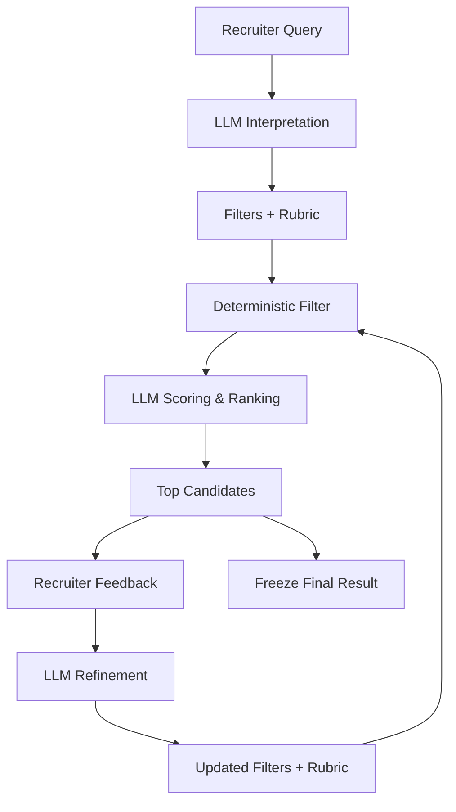
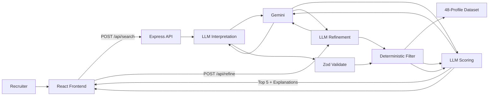
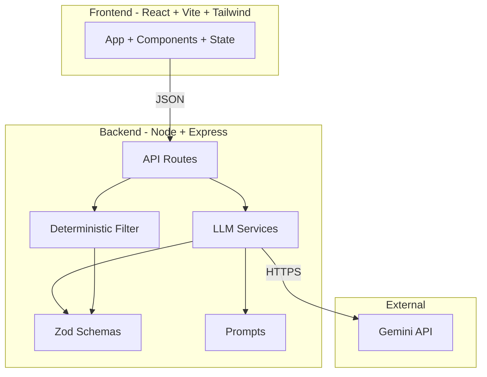

<div align="center">

# Flexiple AI Recruiter

### AI-Powered Sourcing & Refinement Loop

A focused slice of an AI recruiter workflow: a recruiter types a natural-language hiring brief, the system translates it into structured objective filters and a subjective fit rubric, applies the objective requirements against a fictional talent dataset, scores the survivors with an LLM, and lets the recruiter refine the search through feedback until a final shortlist is frozen.

[**Video Walkthrough**](https://drive.google.com/file/d/1KwAt-WH3uRxyEifZJNPlNekOHy7kD8QI/view?usp=sharing)


</div>

---

## 🎥 Video Walkthrough

Google Drive Link -> [**Click Here**](https://drive.google.com/file/d/1KwAt-WH3uRxyEifZJNPlNekOHy7kD8QI/view?usp=sharing)

-> Unfortunately Loom has been demanding to buy subscription, so I have added a drive link of screen recording.

---

## 📦 What is this?

Recruiters usually begin with intent, not filter forms. Boolean search drops nuance; LLM only search is hard to audit. This project combines the two:

1. The recruiter's free text is interpreted by a real server-side Gemini call into a structured `ObjectiveFilters` object and a `FitRubric` object.
2. The objective filters are applied **deterministically** (no LLM) to a supplied 48-profile fictional talent dataset.
3. The surviving candidates are sent back to Gemini and scored against the subjective rubric.
4. The recruiter refines the search with natural-language feedback; Gemini proposes updated filters and rubric; the pipeline re-runs.
5. When the recruiter is happy, the search is **frozen** as the final shortlist.

The focus is a working end to end **sourcing refinement loop**, not a production recruiting platform. The dataset is fictional. There is no real ATS, CRM, auth or persistence and that is intentional.

---

## 🔄 Sourcing Refinement Loop



Each stage is real, not mocked. Every LLM call is a real Gemini call; every filter is a deterministic TypeScript function; every response is Zod-validated.

---

## 🎬 Product Flow

1. Recruiter types a natural language brief into the search panel.
2. UI shows a clear loading state while Gemini interprets, filters, and scores.
3. The **Objective Filters** panel populates with structured hard requirements (skills, experience, locations, company types, optional score threshold).
4. The **Subjective Fit Rubric** panel populates with a summary and weighted criteria.
5. **Top candidates** are ranked as cards with score and a grounded "Why this candidate" explanation. Other objective matches appear below as "Other Matches" with no invented score.
6. Recruiter can click **Yes / No** on any card, or write natural-language feedback in the **Refine Search** area.
7. Refinement returns updated filters, rubric, and ranked list, plus a **What changed and why** panel with `before → after → reason` per change.
8. **Freeze Search** locks the shortlist as final. **New Search** fully resets the session.

---

## 🧩 Engineering Assessment

| Area | Implementation |
|---|---|
| Free-text interpretation | Real server side Gemini call |
| Objective filtering | Deterministic local filter (no LLM) |
| Subjective scoring | Real server-side Gemini call |
| Refinement | Real server side Gemini call |
| Validation | Zod schemas for every request and response |
| Dataset | 48 fictional candidate profiles (JSON) |
| Session state | Frontend, in-memory only |

Cut features were excluded so the actual evaluation criteria stay centred: end-to-end real LLM interaction, deterministic filtering, subjective scoring, real feedback → real model change → real re-run, visible UI state for every backend action, and failure handling for malformed LLM output and API errors.

---

## ✨ Key Features

**Search interpretation** - Free-text → `ObjectiveFilters` + `FitRubric` via real Gemini call (`gemini-3.5-flash-lite`, `@google/genai`). Conservative rules: broad queries like *"Software engineers"* produce empty filters, not invented ones. Zod validation. Malformed JSON and API errors handled with a 502 error path.

**Deterministic filtering** - Inclusive min/max experience, case-insensitive location match, case-insensitive **substring** skill match (so *"RDS"* matches *"AWS RDS"*), company-type match against current **or** past employer. Pure synchronous TypeScript.

**Scoring & ranking** - All objective-filter survivors are scored 0–100 against the rubric by Gemini. Each score has a short explanation that must reference actual profile fields. Sorted by score; top 5 returned.

**Refinement** - Natural-language feedback routed through `POST /api/refine`. Hard vs soft feedback is distinguished: *"must have" / "required" / "only"* → objective filters; *"prioritize" / "prefer" / "stronger"* → rubric weights and descriptions. The smallest reasonable change is made; existing values are preserved unless the feedback clearly calls for change. A `changes` array with `field`, `before`, `after`, `reason` is rendered in the UI.

**Score threshold** - Explicit requests like *"only candidates with a score more than 80"* are extracted into `filters.minScore`. "Above N" / "more than N" → strict (N + 1); "at least N" / "N or higher" → inclusive (N). Applied **after** scoring and **before** the top-5 selection.

**Freeze** - Marks the shortlist final and prevents further refinement until **New Search** is clicked.

**Recruiter UX** - Polished dark interface, sticky header with live session status, filters + rubric panels, ranked candidate cards with prominent score, Yes / No feedback, refinement textarea with change history, intentional loading / error / empty / frozen states.

---

## ⚙️ How It Works



**The boundary that matters:**

| Concern | Owner |
|---|---|
| Interpreting natural language | LLM |
| Subjective scoring | LLM |
| Refinement decisions | LLM |
| Filtering against the dataset | Deterministic TypeScript |
| Validation of every LLM response | Zod |
| Sorting / top-N selection | Deterministic TypeScript |
| Application state and UI transitions | React + Express |

The LLM is only ever asked to do things that require language understanding. Everything that can be done deterministically is done deterministically.

---

## 🏗️ System Architecture



Frontend and backend are cleanly separated, communicate only over JSON, and share no modules at build time. One Express app, three routes, one shared Gemini client, three Zod schemas, three prompts, one pure filter, three small services. No database, queue, cache, or auth.

---

## 🧱 Technology Stack

| Layer | Technology |
|---|---|
| Frontend | React 19 + Vite 7 + TypeScript 5.9 |
| Styling | Tailwind CSS 3.4 |
| Backend | Node.js (ESM) + Express 5 + TypeScript 5.9 |
| Validation | Zod 4 |
| LLM | `@google/genai` 2.21 — model `gemini-3.5-flash-lite` |
| Environment | `dotenv` |
| Build tooling | `tsx` (dev), `tsc` (build), `concurrently`, Vite |

---

## 📁 Project Structure

```text
flexiple-ai-recruiter/
├── backend/
│   ├── data/profiles.json                # 48 fictional candidate profiles
│   └── src/
│       ├── api/                          # health.ts, search.ts, refine.ts
│       ├── data/profiles.ts              # Loads + validates profiles.json
│       ├── filtering/filterProfiles.ts   # Pure deterministic filter
│       ├── llm/                          # client.ts, searchService.ts, scoringService.ts, refinementService.ts
│       ├── prompts/                      # searchInterpretation.ts, scoring.ts, refinement.ts
│       ├── schemas/                      # Zod schemas: health, profile, search
│       └── server.ts
├── frontend/
│   ├── index.html, vite.config.ts, tsconfig.json
│   └── src/
│       ├── App.tsx, main.tsx, types.ts, index.css
│       └── components/                   # SearchPanel, FiltersPanel, RubricPanel, CandidateList,
│                                         # CandidateCard, MatchedProfileCard, RefinementPanel,
│                                         # FreezeButton, LoadingState, ErrorBanner
├── package.json, tsconfig.json, tailwind.config.js, postcss.config.js
├── .env.example
├── LICENSE
└── README.md
```

---

## 🚀 Running Locally

```bash
npm install
cp .env.example .env       # add GEMINI_API_KEY
npm run dev
```

- Frontend: `http://localhost:5173`
- Backend: `http://localhost:3001`
- Vite proxies `/api/*` to the backend.

| Script | What it does |
|---|---|
| `npm run dev` | Frontend + backend in parallel |
| `npm run build` | TypeScript build for both |
| `npm run check` | Typecheck for both |
| `npm start` | Run compiled backend |

`GEMINI_API_KEY` is required for `/api/search` and `/api/refine`. If missing, the server still starts and the health endpoint works; the search/refine endpoints return a 502 with a clear error.

---

## 🔌 API

| Method | Path | Purpose |
|---|---|---|
| `GET` | `/api/health` | Server liveness |
| `POST` | `/api/search` | Interpret free-text query, filter, score, return top 5 |
| `POST` | `/api/refine` | Apply recruiter feedback, re-run filter + score pipeline |

Request body for `/api/search`: `{ "query": "string" }`.
Request body for `/api/refine`: `{ "filters": {...}, "rubric": {...}, "feedback": "string" }`.

---

## 🧠 LLM Engineering

All three LLM calls are real server-side Gemini calls (`gemini-3.5-flash-lite` via `@google/genai`):

1. **Interpretation** (`backend/src/llm/searchService.ts`) - free text → filters + rubric. Conservative rules: empty filters when the query is broad.
2. **Scoring** (`backend/src/llm/scoringService.ts`) - rubric + profiles → scored rankings with grounded explanations. Sorted by score.
3. **Refinement** (`backend/src/llm/refinementService.ts`) - feedback + current state → updated filters + rubric + a `changes` list (field, before, after, reason).

Every response is parsed and validated with Zod. Malformed JSON, missing fields, and LLM/API errors are caught and returned as controlled 502 errors, the Express process never crashes on a bad model response. `GEMINI_API_KEY` is read from the server environment only, never from the client.

---

## 🎯 Engineering Decisions

| Decision | Why |
|---|---|
| Real Gemini calls (no mocks) | Demonstrates the actual LLM interaction the assignment requires |
| Deterministic hard filtering | Objective requirements are predictable and auditable |
| LLM subjective scoring | Qualitative fit is exactly what language models are good at |
| Zod validation on every LLM response | Malformed model output never enters application state |
| Local JSON dataset | Matches assessment scope without unnecessary infrastructure |
| In-memory session state | Sufficient for a single-search assessment flow |
| No auth, database, or persistence | Explicitly outside the assignment scope |

---

## 🪶 Scope & Tradeoffs

Intentionally **not** built: authentication, persistence across sessions, multiple roles, a production-scale talent database, ATS/CRM integrations, production infrastructure (queues, caching, observability), and team/permissioning features.

These are real engineering for a real product, but they are not what this assessment evaluates. The available time was spent on the core sourcing refinement loop and a polished recruiter UX, the two things the assignment actually grades.

---

## 📌 Assessment Submission & License

This repository was created as a submission for the **Flexiple Engineering Hiring assessment**.

It is licensed under a custom **Assessment Evaluation License** (see [`LICENSE`](./LICENSE)). The assessment evaluator is permitted to view, clone, inspect, and execute this repository locally for the purpose of evaluating the submitted engineering work. All other uses  copying, redistribution, modification, publication, deployment, commercial use, or derivative works, require prior written permission from the copyright holder.

The 48-profile dataset is **fictional** and is supplied as part of the assessment brief. This repository is **not an official Flexiple product or production system**, and is not affiliated with Flexiple beyond the assessment context. The `LICENSE` file is the authoritative source for reuse terms.

---

## 👤 Author

Abhay S Kulkarni - Flexiple Engineering Hiring assessment submission.
